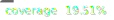

# jsonresume-customtemplate

[](https://opensource.org/licenses/MIT)
 

A **custom template** for generating beautiful resumes in PDF or web format using the [JSON Resume](https://jsonresume.org/) standard.

This project allows you to preview and export resumes using your own template and includes useful utilities like Handlebars helpers and address formatting.

## Features

- 📄 Use your own template for JSON Resume
- ✨ Built-in **Handlebars** helpers for advanced customization
- 📅 Date formatting with **moment**
- 📦 Export resumes to PDF
- 🚀 Local preview server for easy development

## Getting Started

### Prerequisites

- **Node.js** v14 or later
- [Yarn](https://classic.yarnpkg.com/en/docs/install/)

### Installation

Clone the repository and install dependencies:

```bash
git clone https://github.com/tdouillard/jsonresume-customtemplate.git
cd jsonresume-customtemplate
yarn install
```

## Usage

### Pre-requisite Files

Before running `yarn start` or `yarn export`, please make sure to replace the example files with your own:
- Replace `jsonresume-customtemplate/public/assets/profile_picture_example.png` with your own `profile_picture.png`
- Replace `jsonresume-customtemplate/resume_example.json` with your own `resume.json`

These files are required for the resume to render correctly.
 
### Local Preview
 
Start a local server and preview your resume using the custom template:
 
```bash
yarn start
```
 
Your resume will be served at [http://localhost:4000](http://localhost:4000) (default port for `resume serve`).
 
### Export to PDF
 
Generate a PDF using your custom template:
 
```bash
yarn export
```
 
Output: `resume.pdf` in the project directory.
 
## Scripts
 
- `start`: Run local server to preview resume.
- `export`: Export the resume to PDF.
 
## Customization
 
- Customize the template (`index.hbs`) and assets within the project directory.
- Add/modify Handlebars helpers in the template as needed.
- Use the provided dependencies (`moment`, `swag`, etc.) to enhance your template logic.
 
## Dependencies
 
- [address-format](https://www.npmjs.com/package/address-format)
- [express](https://www.npmjs.com/package/express)
- [handlebars](https://www.npmjs.com/package/handlebars)
- [handlebars-wax](https://www.npmjs.com/package/handlebars-wax)
- [moment](https://www.npmjs.com/package/moment)
- [resume-cli](https://github.com/jsonresume/resume-cli)
- [swag](https://www.npmjs.com/package/swag)
 
## License
 
This project is licensed under the MIT License.
 
---
 
**Author:** [tdouillard](https://github.com/tdouillard)
 
Enjoy building your perfect resume! 🚀

